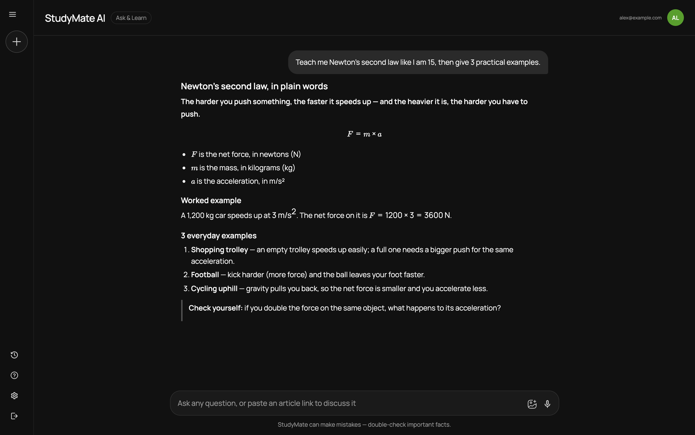
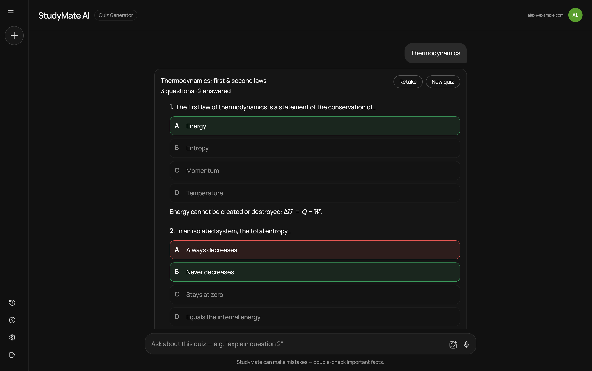

# StudyMate

**An AI study coach.** Ask questions and get step-by-step explanations, upload your handouts, learn from YouTube lessons, and test yourself with interactive quizzes — all in one place.



## Features

| Mode | What it does |
|---|---|
| **Ask & Learn** | Multi-turn tutoring with Markdown and LaTeX maths. Paste an article link and StudyMate reads the page before answering. |
| **Handout Analyzer** | Upload a PDF, image, or `.txt`/`.md` notes (up to 10 MB). Text is extracted server-side; scanned PDFs and photos go to a vision model. |
| **YouTube Tutor** | Paste a video link to load its title, chapters and transcript. Ask follow-ups like *"what happens at 12:30?"* and the answer focuses on that part of the transcript. |
| **Quiz Generator** | Generates structured quizzes (multiple-choice and theory) on a topic or from a source link, with instant feedback, model answers, explanations and a score. |

Also: study sessions saved per user, a progress page (streak, weekly activity, quiz average), voice dictation, light/dark/system themes, email + Google sign-in, and a mobile-first layout.



## Architecture

```
Browser (React + Vite)
  │  Firebase Auth (sign-in)       Firestore (study history, per-user rules)
  │
  └── /api/*  ── Bearer <Firebase ID token> ──▶  Go API (Gin)
                                                  ├─ verifies the token (Firebase Admin)
                                                  ├─ per-user rate limiting
                                                  ├─ PDF / web page / YouTube extraction
                                                  └─ AI router: Gemini → OpenAI fallback
```

- **One container:** the Go server also serves the built React app, so the frontend and API share an origin in production. It's deployed to Cloud Run.
- **No secrets in the browser:** AI and YouTube keys live only on the server. The Firebase web config in `src/firebase.js` is public by design; data is protected by [`firestore.rules`](firestore.rules).

**Stack:** React 18, Vite, MUI, react-markdown + KaTeX · Go 1.26, Gin, Google Gen AI SDK, go-openai · Firebase Auth + Firestore · Docker, Cloud Run, GitHub Actions.

## Getting started

**Prerequisites:** Node 20+, Go 1.26+, and a [Gemini API key](https://aistudio.google.com/apikey) (or an OpenAI key).

```bash
git clone https://github.com/AbrahamAlgorithm/aistudymate.git
cd aistudymate
npm install

cp backend/.env.example backend/.env   # then add GEMINI_API_KEY
```

Run the API and the frontend in two terminals:

```bash
npm run dev:api   # Go API on http://localhost:8080
npm run dev       # Vite on http://localhost:5173 (proxies /api to the Go server)
```

### Environment variables (`backend/.env`)

| Variable | Required | Notes |
|---|---|---|
| `GEMINI_API_KEY` | one of these | Preferred provider. |
| `OPENAI_API_KEY` | one of these | Used if Gemini is not set or fails. |
| `FIREBASE_PROJECT_ID` | yes | Used to verify users' ID tokens. No service account needed. |
| `GEMINI_MODEL` / `OPENAI_MODEL` | no | Defaults: `gemini-2.5-flash` / `gpt-4o-mini`. |
| `YOUTUBE_API_KEY` | no | Adds chapters and descriptions. Without it, titles come from oEmbed. |
| `RATE_LIMIT_PER_MINUTE`, `RATE_LIMIT_BURST` | no | Per-user AI request limits (default 20/min, burst 10). |

### Checks

```bash
npm run lint
npm run build
npm run test:api               # Go unit + handler tests
cd backend && GEMINI_API_KEY=... go test ./internal/ai -run Live -v   # optional live smoke test
```

## Deployment

Pushing to `main` runs lint, build and the Go tests, then deploys to Cloud Run with `gcloud run deploy --source .` (using the root `Dockerfile`).

AI keys are **not** stored in GitHub. Set them once on the Cloud Run service with Secret Manager:

```bash
printf '%s' "YOUR_GEMINI_KEY" | gcloud secrets create gemini-api-key --data-file=- --project my-portfolio-492519
gcloud secrets add-iam-policy-binding gemini-api-key --project my-portfolio-492519 \
  --member "serviceAccount:$(gcloud projects describe my-portfolio-492519 --format='value(projectNumber)')-compute@developer.gserviceaccount.com" \
  --role roles/secretmanager.secretAccessor
gcloud run services update studymate-nau --region us-central1 --project my-portfolio-492519 \
  --update-secrets GEMINI_API_KEY=gemini-api-key:latest
```

Later deploys keep this setting. Also:

- Deploy the Firestore rules: `npx firebase-tools deploy --only firestore:rules`
- In Firebase console → Authentication: enable **Google** as a sign-in provider, and add the Cloud Run domain under **Authorized domains**.

## Project structure

```
src/
  api/client.js          typed calls to the Go API (adds the ID token)
  context/Context.jsx    auth, sessions, modes, history persistence
  components/Main/       chat, markdown renderer, quiz, video card
backend/
  cmd/server/            entrypoint, routing, static file serving
  internal/ai/           Gemini + OpenAI providers and fallback router
  internal/handlers/     chat, handout, youtube, quiz endpoints
  internal/extract/      PDF + web page extraction (SSRF-safe fetcher)
  internal/youtube/      metadata, chapters, transcripts
  internal/middleware/   Firebase token auth, rate limiting
firestore.rules          per-user data access
Dockerfile               single image: React build + Go server
```

## License

MIT — see [LICENSE](LICENSE).

## Contact

Abraham Folorunso — abrahamfolorunso6@gmail.com
