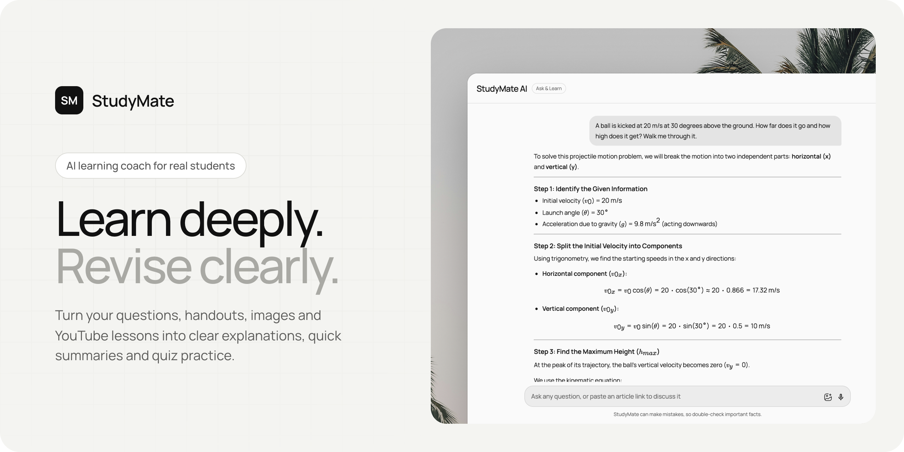
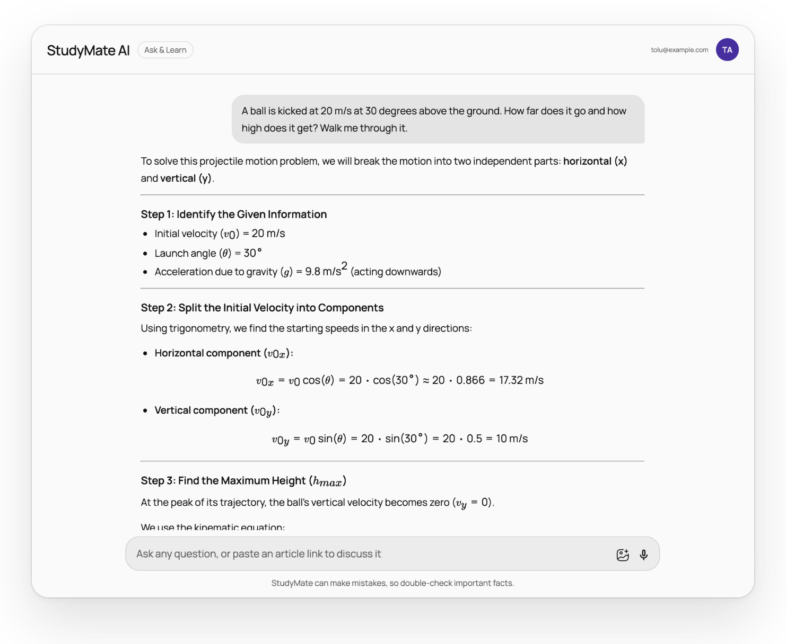
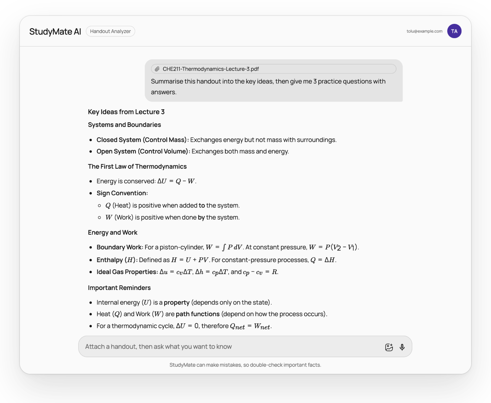
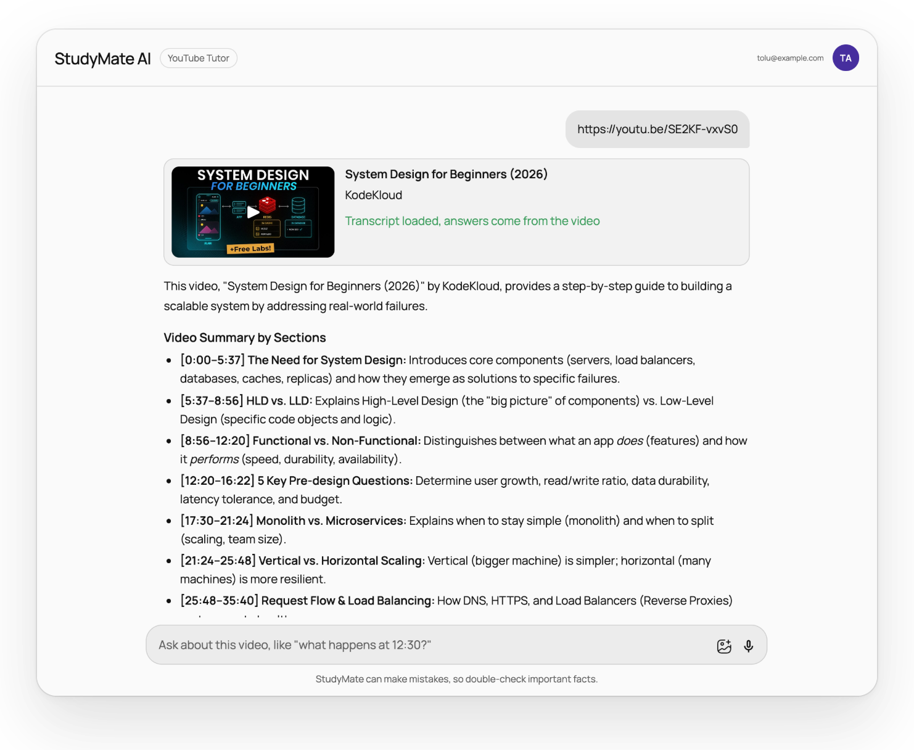
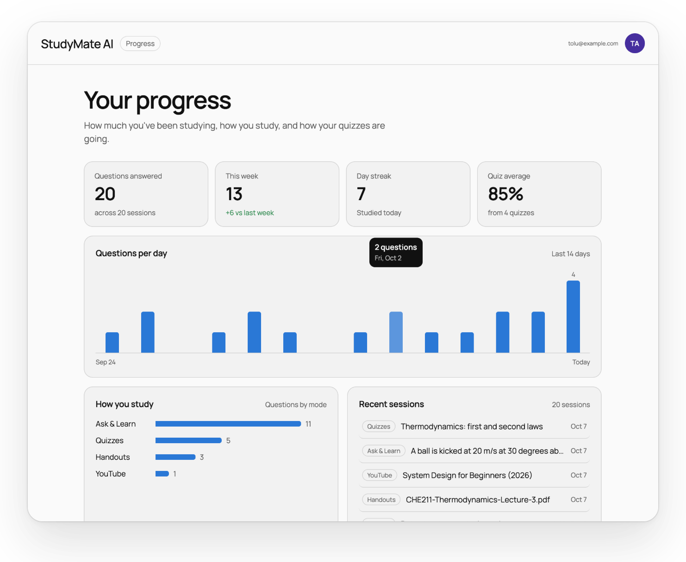
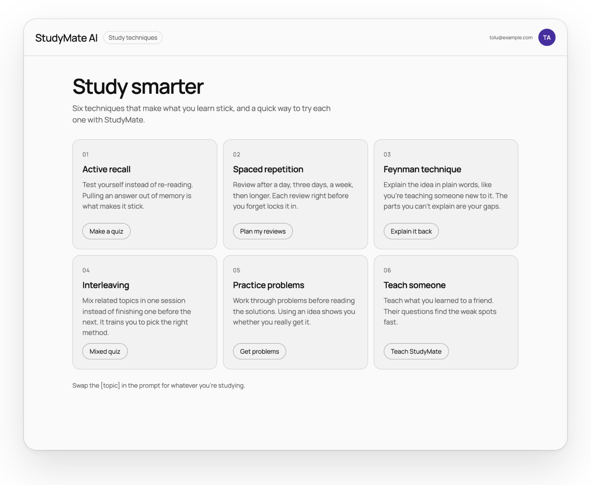
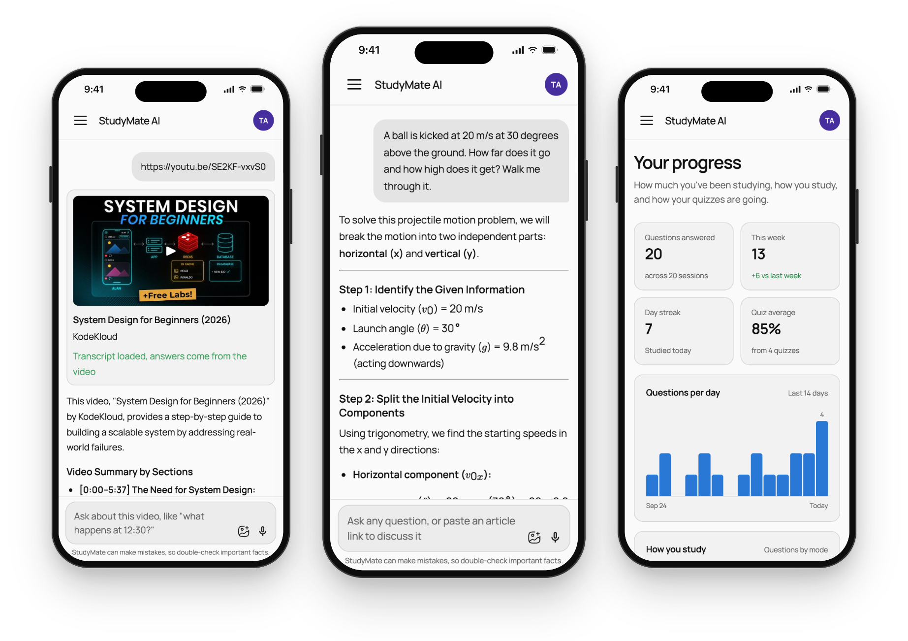
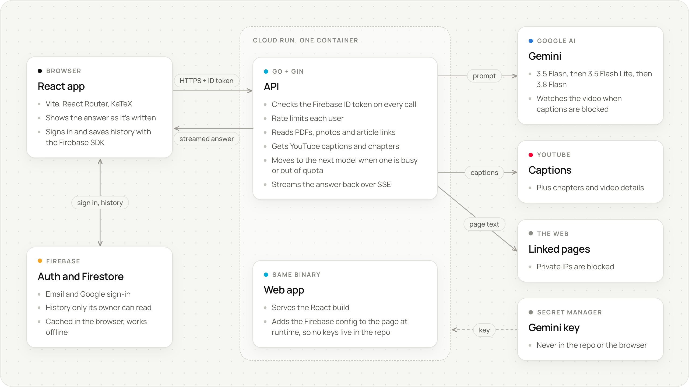

<div align="center">



<br>
<br>


<a href="LICENSE"></a>

<br>
<br>

**[Try it live](https://studymate-nau-taqq76r7ua-uc.a.run.app)** &nbsp;·&nbsp; [Features](#features) &nbsp;·&nbsp; [How it works](#how-it-works) &nbsp;·&nbsp; [Run it locally](#run-it-locally) &nbsp;·&nbsp; [Deploy](#deploy)

</div>

<br>

StudyMate is an AI study partner for students. Ask it a question and get a worked, step-by-step answer with proper math. Drop in a lecture handout and ask about it. Paste a YouTube lecture and ask what happens at 12:30. Then turn any of it into a quiz and see what actually stuck.

Every session is saved to your account, so you can pick up where you left off on any device, and the Progress page shows how you've really been studying.

## Features

<table>
  <tr>
    <td width="50%" valign="top">
      
      <p><b>Ask &amp; Learn</b><br>Ask anything and get a clear answer that shows its working, with equations rendered properly. Paste an article link and StudyMate reads the page before it answers.</p>
    </td>
    <td width="50%" valign="top">
      
      <p><b>Handout Analyzer</b><br>Upload a PDF, a photo of your notes or a text file, up to 10 MB. Get the key ideas, the hard parts explained, or practice questions built from your own material.</p>
    </td>
  </tr>
  <tr>
    <td width="50%" valign="top">
      
      <p><b>YouTube Tutor</b><br>Paste a lecture link and ask about it, down to the timestamp. It reads the transcript and chapters, and when YouTube won't hand over the captions, Gemini watches the video itself.</p>
    </td>
    <td width="50%" valign="top">
      
      <p><b>Quiz Generator</b><br>Quiz yourself on a topic, a link or your notes. Pick 5 to 20 questions, the difficulty and the type. Multiple choice is marked straight away with an explanation, theory questions come with a model answer, and you can ask things like "explain question 2".</p>
    </td>
  </tr>
</table>

### And the rest

<table>
  <tr>
    <td width="50%" valign="top">
      
      <p><b>Progress</b><br>Questions per day, your streak, your quiz average and the modes you lean on, all worked out from your saved history.</p>
    </td>
    <td width="50%" valign="top">
      
      <p><b>Study techniques</b><br>Six techniques that make things stick, like active recall and spaced repetition, each one a click away from trying it in StudyMate.</p>
    </td>
  </tr>
</table>

- **Saved history.** Sessions live in your account and are cached in the browser, so they show up instantly on refresh and still load offline.
- **Streaming answers.** Words show up as they're written, and you can stop an answer halfway.
- **Voice input**, light, dark and system themes, and sign-in with email or Google.

### On your phone

The same app, laid out for small screens. History opens in a drawer and the message box stays above the keyboard.

<p align="center">
  
</p>

## How it works



The Go server does two jobs: it's the API, and it serves the built React app. So StudyMate deploys as one container on Cloud Run, the app and the API share an origin, and it scales to zero when nobody's studying.

A few parts worth knowing about:

- **Streaming.** Answers come back over server-sent events, so you start reading almost straight away instead of waiting for the whole thing.
- **Model fallback.** Requests go to Gemini 3.5 Flash first. If a model is overloaded, slow to start or out of quota, the next one takes over (3.5 Flash Lite, then 3.8 Flash). A busy model sits out for a minute, one that's out of quota sits out until its quota resets, and if they're all out the app tells you when it'll be back. If a model dies halfway through an answer, the app clears what it had and the next model starts again.
- **YouTube.** Transcripts come from the same player API the YouTube app uses, English track first, so there's no YouTube API key. YouTube blocks that now and then (a lot from cloud servers), and when it does, Gemini watches the video directly: only the three minutes around your timestamp if you asked about one, otherwise the whole video at a low frame rate. The free tier covers 8 hours of YouTube video a day.
- **Handouts.** Text is pulled out of PDFs on the server. Scanned PDFs and photos go straight to Gemini, which reads them itself.
- **History.** Stored in Firestore under your user ID. The rules only let you read and write your own, and the Firestore cache means the sidebar fills in instantly.

## Security and privacy

- **No secrets in this repo.** The Gemini key sits in Secret Manager in production and in `backend/.env` locally, and it never reaches the browser.
- **Firebase config at runtime.** The Go server writes the Firebase web config into the page when it serves it (Vite does the same in dev). That key is visible in the browser, like with every Firebase app, so it's restricted to StudyMate's domains and to the Auth and Firestore APIs.
- **Every API call is signed in.** `/api` needs a valid Firebase ID token and is rate limited per user, 20 requests a minute with bursts of 10 by default.
- **Careful with input.** Uploads are capped at 10 MB, request bodies are size limited, and link fetching refuses private and internal network addresses.
- **Your history is yours.** [`firestore.rules`](firestore.rules) only lets a signed-in user touch their own data.

## Tech stack

| Layer | Built with |
|---|---|
| Frontend | React 18, Vite 5, React Router, Framer Motion, MUI on the auth pages, react-markdown with remark-gfm, remark-math and KaTeX |
| Backend | Go 1.26, Gin, Google Gen AI SDK for Go, Firebase Admin SDK, `x/time/rate` |
| AI | Gemini 3.5 Flash, with 3.5 Flash Lite and 3.8 Flash as fallbacks |
| Auth and data | Firebase Authentication (email and Google), Cloud Firestore |
| Infra | Docker, Cloud Run, Secret Manager, GitHub Actions |

## Run it locally

You'll need Node 20+, Go 1.26+, a [Gemini API key](https://aistudio.google.com/apikey) (free), and a Firebase project with Email/Password and Google sign-in turned on and a Firestore database.

```bash
git clone https://github.com/AbrahamAlgorithm/ai-studymate.git
cd ai-studymate
npm install
cp backend/.env.example backend/.env   # then fill it in, see below
npm run dev                            # Go API on :8080, app on http://localhost:5173
```

`npm run dev` starts both. `npm run dev:api` or `npm run dev:web` runs just one. If you're using your own Firebase project, publish [`firestore.rules`](firestore.rules) to it from the Firebase console (Firestore > Rules).

### Environment variables

These all go in `backend/.env`, which git ignores.

| Variable | Required | What it's for |
|---|---|---|
| `GEMINI_API_KEY` | yes | Your Gemini key. Only the server sees it. |
| `FIREBASE_PROJECT_ID` | yes | The Firebase project to check sign-ins against. No service account needed. |
| `FIREBASE_WEB_API_KEY` | yes | Firebase's browser key. Handed to the page at runtime, never committed. Restrict it to your domains. |
| `GEMINI_MODEL` | no | Main model, `gemini-3.5-flash` by default. |
| `GEMINI_FALLBACK_MODELS` | no | Comma separated, tried in order. Defaults to `gemini-3.5-flash-lite,gemini-3.8-flash`. |
| `GEMINI_THINKING` | no | `minimal` (default), `low`, `medium` or `high`. More thinking means slower answers. |
| `RATE_LIMIT_PER_MINUTE`, `RATE_LIMIT_BURST` | no | Per-user limits, 20 a minute with bursts of 10 by default. |
| `ALLOWED_ORIGINS` | no | Extra origins allowed to call the API. The local Vite ports are always allowed. |
| `PORT` | no | `8080` by default. |

### Tests

```bash
npm run lint
npm run build
npm run test:api                                        # Go unit tests
```

The live tests call the real services, so they're skipped unless you opt in:

```bash
cd backend
go test ./internal/... -run Live -v                     # needs GEMINI_API_KEY exported
YOUTUBE_LIVE=1 go test ./internal/youtube -run Live -v  # fetches a real video and transcript
```

## Deploy

Pushing to `main` runs the lint, build and Go tests in GitHub Actions, then deploys to Cloud Run with `gcloud run deploy --source .` using the root [`Dockerfile`](Dockerfile).

The Gemini key isn't stored in GitHub. Put it in Secret Manager once and point the service at it:

```bash
PROJECT=my-portfolio-492519
REGION=us-central1
SERVICE=studymate-nau
NUMBER=$(gcloud projects describe $PROJECT --format='value(projectNumber)')

printf '%s' "$GEMINI_API_KEY" | gcloud secrets create gemini-api-key --data-file=- --project $PROJECT
gcloud secrets add-iam-policy-binding gemini-api-key --project $PROJECT \
  --member "serviceAccount:$NUMBER-compute@developer.gserviceaccount.com" \
  --role roles/secretmanager.secretAccessor
gcloud run services update $SERVICE --region $REGION --project $PROJECT \
  --update-secrets GEMINI_API_KEY=gemini-api-key:latest
```

Set `FIREBASE_PROJECT_ID` and `FIREBASE_WEB_API_KEY` on the service the same way with `--update-env-vars`. Later deploys keep all three.

A few notes on the setup:

- StudyMate shares its Google Cloud project with other apps, so it keeps to the `studymate_users` and `studymate_contact` collections, and `firestore.rules` denies everything else.
- Adding a custom domain? Add it to Firebase Auth's authorized domains and to the web key's allowed referrers.
- It runs inside the free tiers: Cloud Run scales to zero, Firestore gives 50,000 reads and 20,000 writes a day, and Auth covers 50,000 monthly users. Billing is on for Cloud Run, so a budget alert is still a good idea.

## Project structure

```
src/
  api/client.js            talks to the Go API, adds the ID token, reads the stream
  context/Context.jsx      auth, sessions, modes and history
  components/
    Main/                  chat, markdown and math, quiz, video card
    Sidebar/               history, navigation, theme picker
    Shell/                 top bar and page layout shared by the pages
    Progress/              stats and the activity chart
    LearningTips/          study techniques
    Landing/ Auth/         landing page, sign in and sign up
  firebase.js              Firebase setup from the config the server injects
backend/
  cmd/server/              entrypoint, routes, serves the built app
  internal/ai/             Gemini client, streaming, model fallback
  internal/handlers/       chat, handout, youtube and quiz endpoints
  internal/extract/        PDF and web page text, blocks private addresses
  internal/youtube/        video details, chapters, transcripts
  internal/middleware/     Firebase token check, rate limiting
  internal/static/         serves the React build with the Firebase config
firestore.rules            who can read and write what
Dockerfile                 one image with the React build and the Go server
```

## License

MIT, see [LICENSE](LICENSE).

## Contact

Built by Abraham Folorunso ([@AbrahamAlgorithm](https://github.com/AbrahamAlgorithm)). Questions, ideas or bugs: abrahamfolorunso6@gmail.com, or open an issue.
